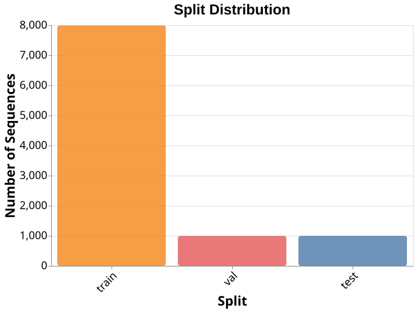
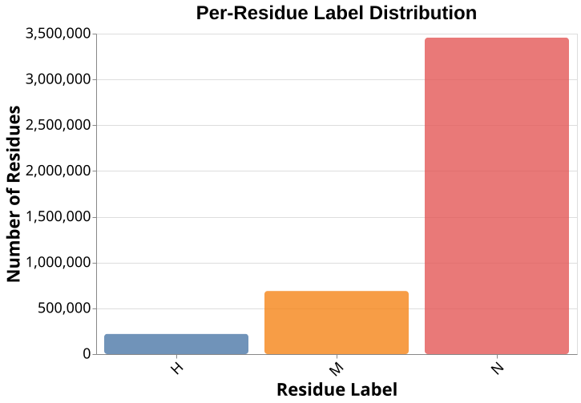
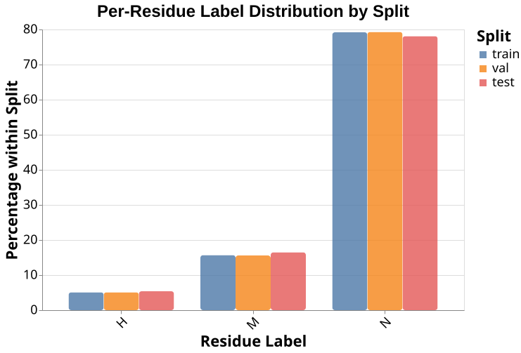
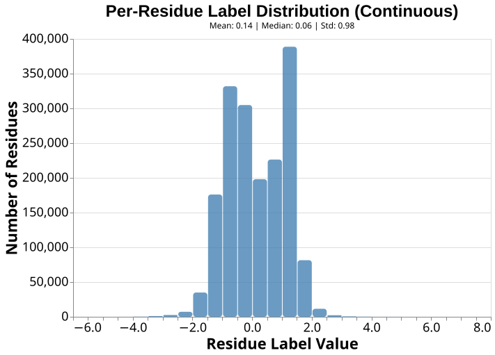
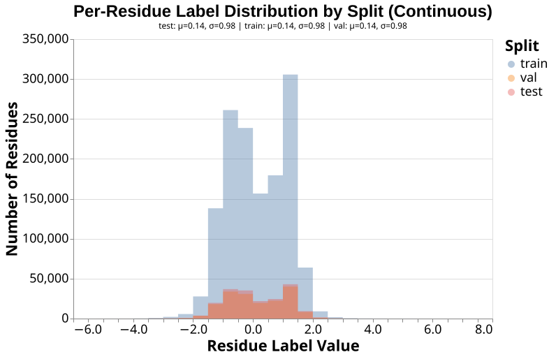
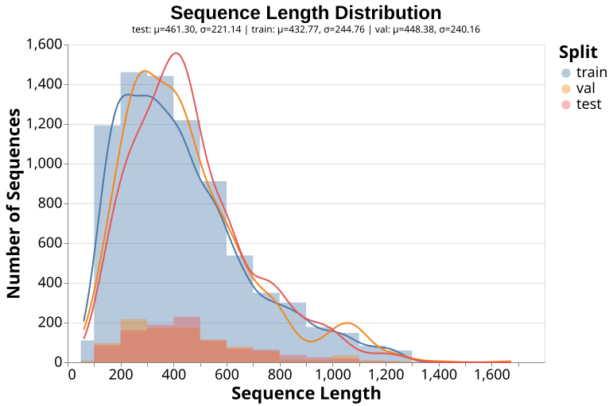

# Frustration

## Description

* TODO: Classes and regression values

## Dataset Compilation

The provided dataset is compiled as follows:

*TODO*

## Dataset Format

The dataset is provided in [biotrainer-ready](https://github.com/sacdallago/biotrainer) fasta format.
Each entry contains a sequence and a header, providing the sequence id, the set (train/val/test),
the target scores (separated by ';') or classes and masks (unresolved (0): disorder value == 999, otherwise resolved (1)).

## Dataset Analysis

### Classification








### Regression








## Citations

```bibtex
@Article{Leusch2026,
  author    = {Leusch, Jan-Philipp and Poley-Gil, Miriam and Fernandez-Martin, Miguel and Bordin, Nicola and Rost, Burkhard and Parra, R. Gonzalo and Heinzinger, Michael},
  title     = {FrustrAI-Seq: Scaling Local Energetic Frustration to the Protein Sequence Space},
  year      = {2026},
  month     = Feb,
  doi       = {10.64898/2026.02.03.703498},
  publisher = {openRxiv},
}
```

## Data licensing

* **TODO**

The RAW data downloaded from the aforementioned publications is subject
to **TODO**.
Modified data available in this repository falls under [MIT](https://opensource.org/licenses/MIT).
